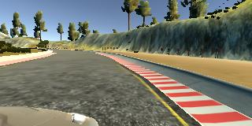

# **Writeup - CarND-Behavioral-Cloning-P3** 

---

**Behavrioal Cloning Project**

The goals / steps of this project are the following:
* Use the simulator to collect data of good driving behavior
* Build, a convolution neural network in Keras that predicts steering angles from images
* Train and validate the model with a training and validation set
* Test that the model successfully drives around track one without leaving the road
* Summarize the results with a written report

## Rubric Points
---
### Files Submitted & Code Quality

#### 1. Submission includes all required files and can be used to run the simulator in autonomous mode

Project includes the following files:
* model.py containing the script to create and train the model
* drive.py for driving the car in autonomous mode
* model.h5 containing a trained convolution neural network 
* writeup_report.md summarizing the results

#### 2. Submssion includes functional code
Using the Udacity provided simulator and my drive.py file, the car can be driven autonomously around the track by executing 
```sh
python drive.py model.h5
```

#### 3. Submssion code is usable and readable

The model.py file contains the code for training and saving the convolution neural network. The file shows the pipeline I used for training and validating the model, and it contains comments to explain how the code works.

## Model Architecture
---

#### 1. An appropriate model architecture has been employed

Model consists of a convolution neural network with 5x5 filter sizes and depths between 32 and 128. This has been adopted from the [NVIDIA Paper](https://images.nvidia.com/content/tegra/automotive/images/2016/solutions/pdf/end-to-end-dl-using-px.pdf):
```python
model.add(Convolution2D(24,5,5, init='glorot_uniform', subsample=(2, 2), border_mode='same', activation='relu'))
model.add(MaxPooling2D(pool_size=(2,2), strides=(1, 1)))
```

The model includes RELU layers to introduce nonlinearity:
```python
model.add(Activation('relu'))
```

The data is normalized in the model using a Keras lambda layer: 
```python
model.add(Lambda(lambda x: x/127.5-1., input_shape=(col, row, ch), output_shape=(col, row, ch)))
```

#### 2. Attempts to reduce overfitting in the model

1. The model contains dropout layers in order to reduce overfitting:
```python
model.add(Dropout(0.2))
```

2. The model was trained and validated on different data sets to ensure that the model was not overfitting. The samples were split into training (80%) and validation (20%) sets randomly:
```python
train_samples, validation_samples = train_test_split(samples, test_size=0.2)
```

3. The model was tested by running it through the simulator and ensuring that the vehicle could stay on the track.

#### 3. Model parameter tuning

5 number of Epochs were sufficient for training. The model used an adam optimizer, so the learning rate was not tuned manually. The model was compiled using the Mean Square Error:
```python
model.compile(loss='mse', optimizer='adam')
```

## Training Strategy
---
#### 3. Creation of the Training Set & Training Process

**Data Collection:**
Data was collected while keeping the vehicle in the center. The left, center and right camera were used. A number of samples were also collected such that the vehicle vehicle was recovering. Additional data was collected at turns where the vehicle was failing to keep in the lane.
<p align="left">
  
</p>
<p align="center">
  
</p>
<p align="right">
  
</p>

**Reducing Zero Band:**
It was observed that many of the images had zero steering angle associated with them. Hence even if the vehicle was headed towards the outside of the road, it did not learn to recover because it would predict the angle as $^{\circ}$
```python
if float(line[3]) == 0:
            if np.random.random() < zero_angle_keep:
                hist_angle.append(float(line[3]))
                samples.append(line)
        else:
            hist_angle.append(float(line[3]))
            samples.append(line)
```
<p align="center">
  
</p>

**Data Augmentation:**
Data augmentation is the process of modifying the training data in order to increase the number of samples. 

_Flipping_ helped remove the bias which was generated as a result of driving in one particular direction. However for every image which was flipped, the steering wheel angle had to be inverted. E.g. if the steering angle is $+5^{\circ}$ then for the flipped image the corresponding angle is $-5^{\circ}$ 
```python
def i_flip(I, steering):
    return cv2.flip(I,1), -steering
```
<p align="center">
  
</p>

_Jitter_ helped generalized the model significantly. It may be one of the reason the vehicle was able to maneuver the turn after the bridge.
```python
def i_jitter(I, steering):
    I = cv2.cvtColor(I, cv2.COLOR_RGB2HSV)
    I[:,:,2] = I[:,:,2]+(np.random.uniform(-20,20))
    return cv2.cvtColor(I, cv2.COLOR_HSV2RGB), steering 
```

### Generators
Generators helped control the number of samples sent through a batch. This enabled learning on GPUs with limited memory.
```python
yield shuffle(X_train, y_train)
```
## Testing Strategy
---
For a very long time the car kept going out no matter how much training data  used. Later it was observed, that the steering angle correction sign was inverted. After the correction was made, the car was able to successfully cross the bridge after which it left the lane
<p align="center">
  
</p>
```python
left_angle = float(batch_sample[3]) + steering_ang_correction
```
The vehicle kept going off the track after the bridge. This was corrected by taking additional samples at the location.
<p align="center">
  
</p>

---

# *** END of CarND-Behavioral-Cloning-P3 *** 